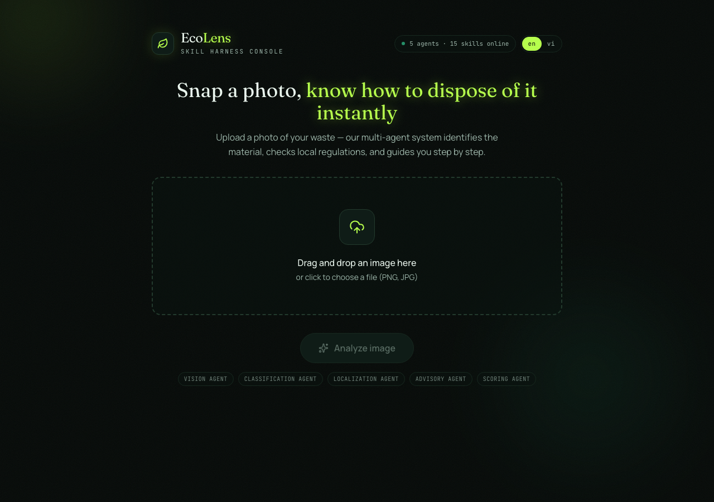
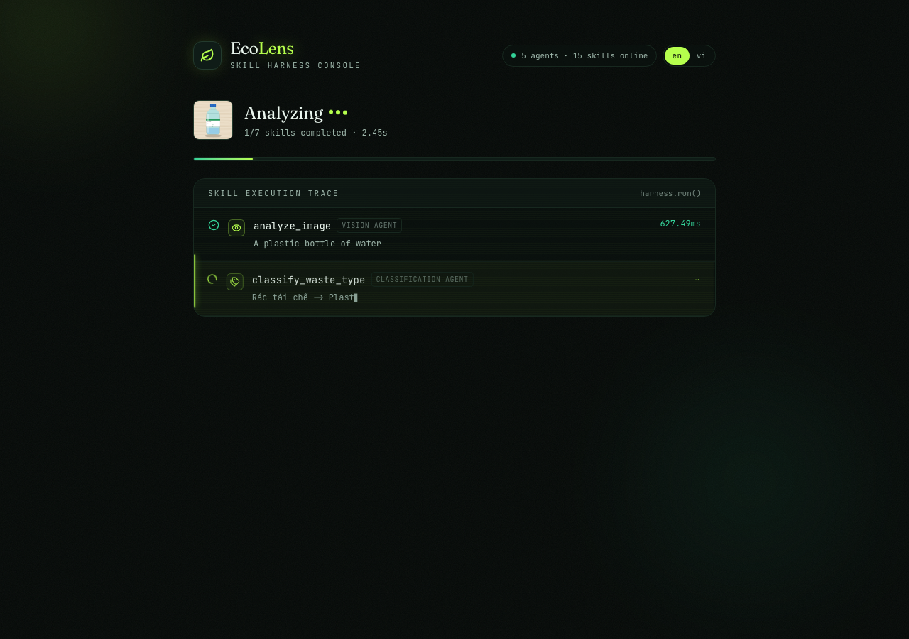
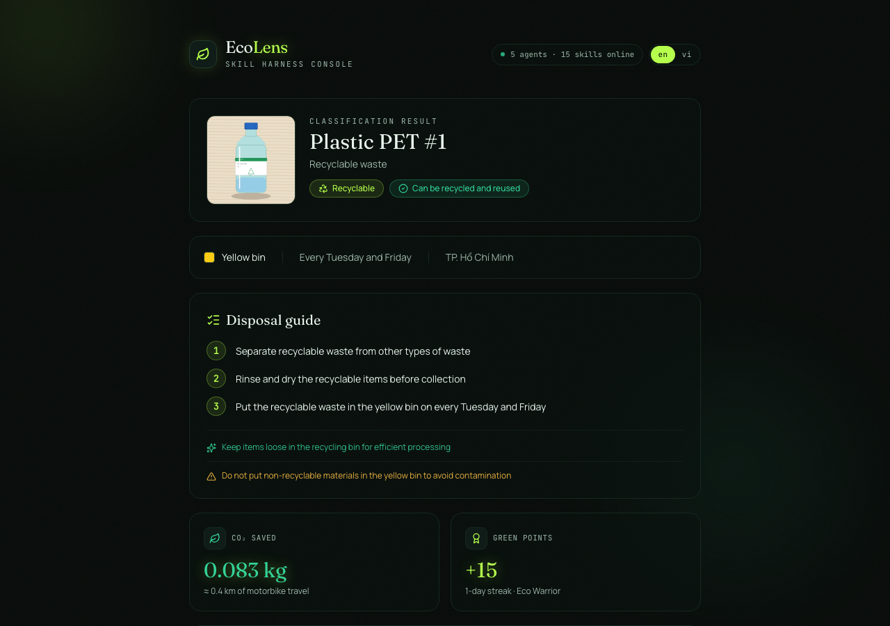
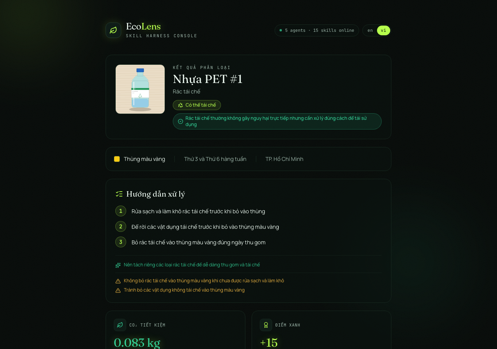
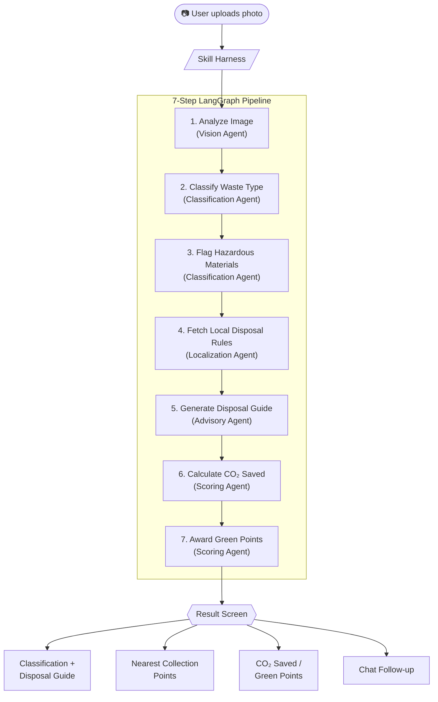

# EcoLens — AI Waste Sorting Assistant

EcoLens turns a single photo into a complete waste-disposal action plan.
Upload a picture of an item and a pipeline of specialized AI agents
identifies the object, classifies the waste category, flags hazardous
materials, looks up local disposal rules, and generates a step-by-step
disposal guide — all in a few seconds. It also estimates the CO₂ saved and
awards "green points" to encourage a recycling habit over time.

## Screenshots

| Upload | Live Skill Execution Trace |
| --- | --- |
|  |  |

| Result (English) | Result (Vietnamese) |
| --- | --- |
|  |  |

## Key Features

- **Photo-based waste classification** — a vision-capable LLM (Groq Llama 4
  Scout) describes the object and a classification agent sorts it into
  Recyclable / Organic / Hazardous / General waste, with a more specific
  subcategory (e.g. "PET plastic bottle").
- **Live Skill Execution Trace** — a real-time, animated log of every agent
  call in the 7-step pipeline (analyze image → classify → flag hazards →
  fetch local rules → generate guide → calculate CO₂ → award points), with
  per-step latency and output summaries.
- **Localized disposal guidance** — bin color, collection day/schedule, and
  a step-by-step disposal guide tailored to the user's city.
- **Hazard detection** — flags hazardous items (batteries, chemicals,
  electronics) with a clear warning and reason.
- **Nearest collection points** — uses the browser's geolocation plus a
  haversine-distance lookup to show the closest disposal/recycling points.
- **Environmental impact tracking** — CO₂ saved per scan (converted to
  "equivalent km of motorbike travel"), cumulative green points, streaks,
  and badges (Eco Starter → Eco Warrior → Eco Champion).
- **Conversational follow-up** — an in-context chat panel for follow-up
  questions, grounded in the just-completed scan.
- **Full English/Vietnamese bilingual support** — a one-click language
  toggle (default: English) switches every UI string *and* every
  AI-generated field between English and Vietnamese, while keeping real
  place names/addresses in their authentic local form.

## How It Works



## Architecture

EcoLens is built around a **Skill Harness**: every AI capability is an
independent, swappable "skill" with a defined input/output schema, routed
through a central harness that handles validation, retries, and execution
logging. A LangGraph orchestrator runs a 7-node pipeline across 5 agents
(Vision, Classification, Localization, Advisory, Scoring), and the UI
surfaces this as a live Skill Execution Trace.

- **Frontend**: React 19, Vite, Tailwind CSS, Framer Motion, lucide-react
- **Backend**: FastAPI (Python)
- **Agent orchestration**: LangGraph (typed state graph, 7-node pipeline)
- **LLM / Vision**: Groq API — Llama 4 Scout (vision) and Llama 3.3 70B
  (text generation)
- **Database**: SQLite for per-user environmental impact tracking
- **Geolocation**: browser Geolocation API + haversine distance for nearest
  disposal points

## Getting Started

### Backend

```bash
cd backend
python -m venv .venv
source .venv/bin/activate
pip install -r requirements.txt
cp .env.example .env   # then set GROQ_API_KEY
uvicorn app.main:app --reload
```

The API runs at `http://localhost:8000`.

### Frontend

```bash
cd frontend
npm install
cp .env.example .env   # VITE_API_BASE_URL=http://localhost:8000
npm run dev
```

The app runs at `http://localhost:5173`.

## Project Structure

```
backend/
  app/
    agents/        # Vision, Classification, Localization, Advisory, Scoring agents
    api/           # FastAPI routes (scan, chat, user, disposal-points)
    data/          # local_rules.json (bilingual disposal rules by city)
    harness/       # Skill registry, router, normalizer, execution logger
    orchestrator/  # LangGraph pipeline definition
    schemas/       # Pydantic request/response schemas
frontend/
  src/
    EcoLensDemo.jsx  # Main UI (upload / processing / result screens)
    lib/             # API client + i18n translations
screenshots/         # README screenshots
```

## License

MIT — see [`LICENSE`](./LICENSE).
